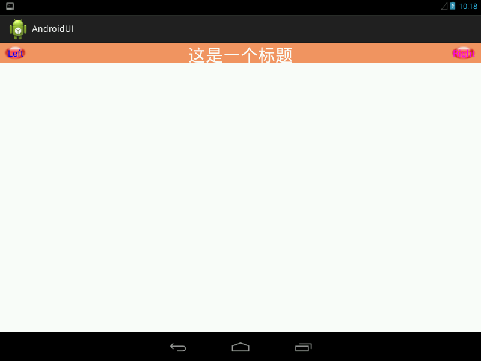

##基本介绍  
本程序实现了一个自定义控件，该控件可作为UI页面的导航控件。  
程序效果图如下：  
  

##主要知识点   
1. 自定义控件  
当我们要实现自己的自定义组合控件时，一般从类`ViewGroup`或其子类继承，
并实现其中的一个或多个构造函数。  
```java
public class Topbar extends RelativeLayout {
    ...

    public Topbar(final Context context, AttributeSet attrs) {
        ...
    }
    ..
}
```

2. 自定义控件属性  
由于我们要自定义控件的一些属性，所以我们需要实现带有`AttributeSet`参数的构造方法，
在该构造方法中，我们会将自定义的一些属性与控件中定义的一些子控件的属性对应起来：
```java
public Topbar(final Context context, AttributeSet attrs) {
		super(context, attrs);
		// TODO Auto-generated constructor stub
		TypedArray ta = context.obtainStyledAttributes(attrs,
				R.styleable.Topbar);
		leftTextColor = ta.getColor(R.styleable.Topbar_leftTextColor, 0);
		leftBackground = ta.getDrawable(R.styleable.Topbar_leftBackground);
		leftText = ta.getString(R.styleable.Topbar_leftText);

		rightTextColor = ta.getColor(R.styleable.Topbar_rightTextColor, 0);
		rightBackground = ta.getDrawable(R.styleable.Topbar_rightBackground);
		rightText = ta.getString(R.styleable.Topbar_rightText);

		titleTextSize = ta.getDimension(R.styleable.Topbar_titleTextSize, 0);
		titleColor = ta.getColor(R.styleable.Topbar_titleTextColor, 0);
		title = ta.getString(R.styleable.Topbar_titleText);

		// 回收
		ta.recycle();

		leftButton = new Button(context);
		rightButton = new Button(context);
		tvTitle = new TextView(context);

		leftButton.setTextColor(leftTextColor);
		leftButton.setBackground(leftBackground);
		leftButton.setText(leftText);

		rightButton.setTextColor(rightTextColor);
		rightButton.setBackground(rightBackground);
		rightButton.setText(rightText);

		tvTitle.setTextColor(titleColor);
		tvTitle.setTextSize(titleTextSize);
		tvTitle.setText(title);
		tvTitle.setGravity(Gravity.CENTER); // 居中

		setBackgroundColor(0xFFF59563);

		leftParams = new LayoutParams(ViewGroup.LayoutParams.WRAP_CONTENT,
				LayoutParams.WRAP_CONTENT);
		leftParams.addRule(RelativeLayout.ALIGN_PARENT_LEFT, TRUE);
		addView(leftButton, leftParams);

		rightParams = new LayoutParams(ViewGroup.LayoutParams.WRAP_CONTENT,
				LayoutParams.WRAP_CONTENT);
		rightParams.addRule(RelativeLayout.ALIGN_PARENT_RIGHT, TRUE);
		addView(rightButton, rightParams);

		titleParams = new LayoutParams(ViewGroup.LayoutParams.WRAP_CONTENT,
				LayoutParams.MATCH_PARENT);
		titleParams.addRule(RelativeLayout.CENTER_IN_PARENT, TRUE);
		addView(tvTitle, titleParams);
        ...
}
```

3. 在xml中定义的控件属性如下所示：  
```xml
<?xml version="1.0" encoding="utf-8"?>
<resources>
    <declare-styleable name="Topbar">
       <attr name="titleText" format="string"/>
        <attr name= "titleTextSize" format="dimension"/>
        <attr name = "titleTextColor" format = "color"/>
        <attr name = "leftTextColor" format = "color"/>
        <attr name = "leftBackground" format="reference|color"/>
        <attr name = "leftText" format = "string"/>
        <attr name = "rightTextColor" format = "color"/>
        <attr name = "rightBackground" format = "reference|color"/>
        <attr name = "rightText" format = "string"/>
    </declare-styleable>
    
</resources>
```

4. 在布局文件中使用自定义控件  
```xml
 <RelativeLayout xmlns:android="http://schemas.android.com/apk/res/android"
    xmlns:custom="http://schemas.android.com/apk/res-auto"
    android:layout_width="fill_parent"
    android:layout_height="fill_parent" >
    
    <com.fyj.androidui.Topbar 
        android:id="@+id/topbar"
        android:layout_width="match_parent"
        android:layout_height="40dp"
        custom:leftBackground = "@drawable/button"
        custom:leftTextColor = "#0000FF"
        custom:leftText = "Left"
        custom:rightBackground="@drawable/button"
        custom:rightTextColor = "#FF00FF"
        custom:rightText = "Right"
        custom:titleText = "这是一个标题"
        custom:titleTextSize = "16pt"
        custom:titleTextColor = "#FFFFFF"
        
        
        ></com.fyj.androidui.Topbar>

</RelativeLayout>
```

