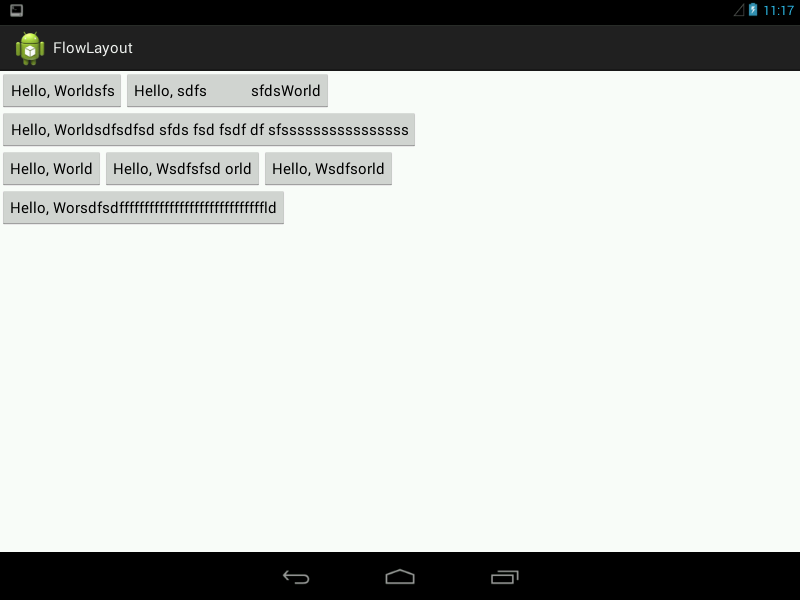

##自定义ViewGroup：
1. onMeasure: 测量子View的宽和高，设置自己的宽和高。
2. onLayout: 设置子View的位置。

onMeasure: 根据子View的布局文件，为子View设置测试模式和测量值。

测量 = 测量模式 + 测量值：
测试模式：3 种：  
1. EXACTLY：match_parent   
2. AT_MOST: wrap_content  
3. UNSPECIFIED：子控件想要多大，就多大。  

##测量子View和自己的宽和高  
```java  
	protected void onMeasure(int widthMeasureSpec, int heightMeasureSpec) {
		int sizeWidth = MeasureSpec.getSize(widthMeasureSpec);
		int modeWidth = MeasureSpec.getMode(widthMeasureSpec);
		
		int sizeHeight = MeasureSpec.getSize(heightMeasureSpec);
		int modeHeight = MeasureSpec.getMode(heightMeasureSpec);
		
		//wrap content
		int width = 0;
		int height = 0;
		int lineWidth = 0; //每一行的宽度
		int lineHeight = 0; //每一行的高度
		
		//得到内部元素的个数
		int cCount = getChildCount();
		
		for (int i = 0; i < cCount; i++) {
			View child = getChildAt(i);
			//测量子View的宽度和高度
			measureChild(child, widthMeasureSpec, heightMeasureSpec);
			//得到LayoutParams
			MarginLayoutParams lp = (MarginLayoutParams)child.getLayoutParams();
			
			//子View占据的宽度
			int childWidth = child.getMeasuredWidth() + lp.leftMargin + lp.rightMargin;
			//子View占据的高度
			int childHeight = child.getMeasuredHeight() + lp.topMargin + lp.bottomMargin;
			
			//换行
			if (lineWidth + childWidth > sizeWidth) {
				width = Math.max(width,  lineWidth);
				lineWidth = childWidth;
				height += lineHeight;
				
				lineHeight = childHeight;
			} else {
				lineWidth += childWidth;
				lineHeight = Math.max(lineHeight, childHeight);
			}
			
			//最后一个控件
			if (i == cCount - 1) {
				width = Math.max(lineWidth, width);
				height += lineHeight;
			}
		}
		
		if (modeWidth == MeasureSpec.AT_MOST) {
			setMeasuredDimension(widthMeasureSpec, width );
		} else {
			setMeasuredDimension(widthMeasureSpec, sizeWidth);
		}
		
		if (modeHeight == MeasureSpec.AT_MOST) {
			setMeasuredDimension(heightMeasureSpec, height );
		} else {
			setMeasuredDimension(heightMeasureSpec, sizeHeight);
		}
	}
```

##布局子View  
```java  
protected void onLayout(boolean arg0, int arg1, int arg2, int arg3, int arg4) {
		// TODO Auto-generated method stub
		mAllViews.clear();
		mLineHeight.clear();
		
		//当前ViewGroup的高度
		int width = getWidth();
		
		int lineWidth = 0;
		int lineHeight = 0;
		
		List<View> lineViews = new ArrayList<View>();
		int cCount = getChildCount();
		for (int i = 0; i < cCount; i++) {
			View child = getChildAt(i);
			MarginLayoutParams lp = (MarginLayoutParams)child.getLayoutParams();
			int childWidth = child.getMeasuredWidth();
			int childHeight = child.getMeasuredHeight();
			
			//如果需要换行
			if (childWidth + lineWidth + lp.leftMargin + lp.rightMargin > width) {
				//记录LineHeight
				mLineHeight.add(lineHeight);
				//记录当前行的views
				mAllViews.add(lineViews);
				//重置当前行的宽和高
				lineWidth = 0;
				lineHeight = childHeight + lp.topMargin + lp.bottomMargin;
				
				lineViews = new ArrayList<>();
			}
			
			lineWidth += childWidth + lp.leftMargin + lp.rightMargin;
			lineHeight = Math.max(lineHeight, childHeight + lp.topMargin + lp.bottomMargin);
			lineViews.add(child);
		}
		//处理最后 一行
		mLineHeight.add(lineHeight);
		mAllViews.add(lineViews);
		
		//设置子View的位置
		int left = 0;
		int top = 0;
		
		//行数
		int lineNum = mAllViews.size();
		for (int i = 0; i < lineNum; i++) {
			//当前行的所有View
			lineViews = mAllViews.get(i);
			lineHeight = mLineHeight.get(i);
			
			//为每行View进行布局
			for (int j = 0; j < lineViews.size(); j++) {
				View child = lineViews.get(j);
				//是否可视
				if (child.getVisibility() == View.GONE) {
					continue;
				}
				
				MarginLayoutParams lp = (MarginLayoutParams)child.getLayoutParams();
				
				int lc = left + lp.leftMargin;
				int tc = top + lp.topMargin;
				int rc = lc + child.getMeasuredWidth();
				int bc =tc + child.getMeasuredHeight();
				
				//为子View进行布局
				child.layout(lc, tc, rc, bc);
				left +=  child.getMeasuredWidth() + lp.leftMargin + lp.rightMargin;
			}
			left = 0;
			top += lineHeight;
		}
		
	}
```

**程序运行效果**


